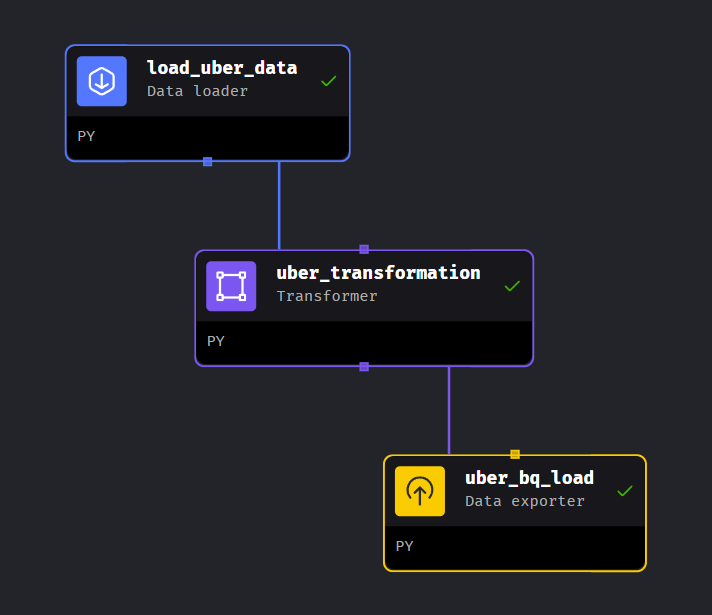

# Data Engineering Project Readme

## Project Overview

This data engineering project focuses on extracting, transforming, and loading (ETL) taxi data from the NYC government into Google Cloud Platform (GCP). The goal is to process the raw data, store it efficiently, and enable data analysis through visualization tools.

## Data Source

The project utilizes taxi data provided by NYC.gov (https://www.nyc.gov/site/tlc/about/tlc-trip-record-data.page). This dataset contains valuable information about taxi trips in New York City.

## Data Storage

All raw and processed data is stored in Google Cloud Storage (GCS) in CSV format. GCS provides scalable and durable cloud storage, ensuring accessibility and reliability of the data.

## ETL Process

The ETL process is performed using Mage AI, executed on a Compute Engine virtual machine (VM) within the Google Cloud Platform. Mage AI is responsible for extracting data, applying transformations, and loading it into the desired format for further analysis.

## Destination Data Warehouse

The transformed data is loaded into Google BigQuery, a fully-managed, serverless data warehouse that enables fast SQL queries using the processing power of Google's infrastructure. BigQuery is used for its scalability, performance, and ease of integration with other GCP services.

## Visualization

The final step involves visualizing the processed data using Looker Studio. Looker Studio provides a user-friendly interface for creating and exploring data visualizations, allowing for insightful analysis of the taxi data.

You can access the dashboard here (https://lookerstudio.google.com/reporting/8c4deb1f-c56a-4c23-b95c-ea4966882256)

thanks to @darshilparmar for the guide
https://youtu.be/WpQECq5Hx9g?si=mT1B4BolMYHBcAfI
